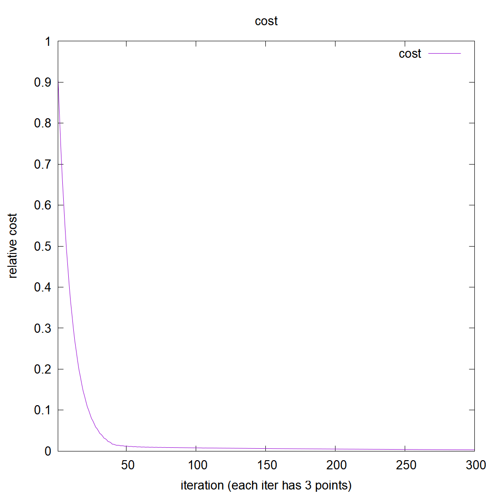
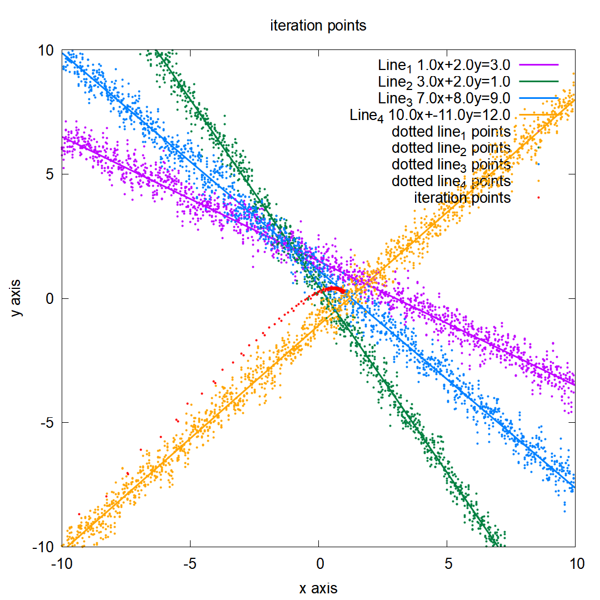
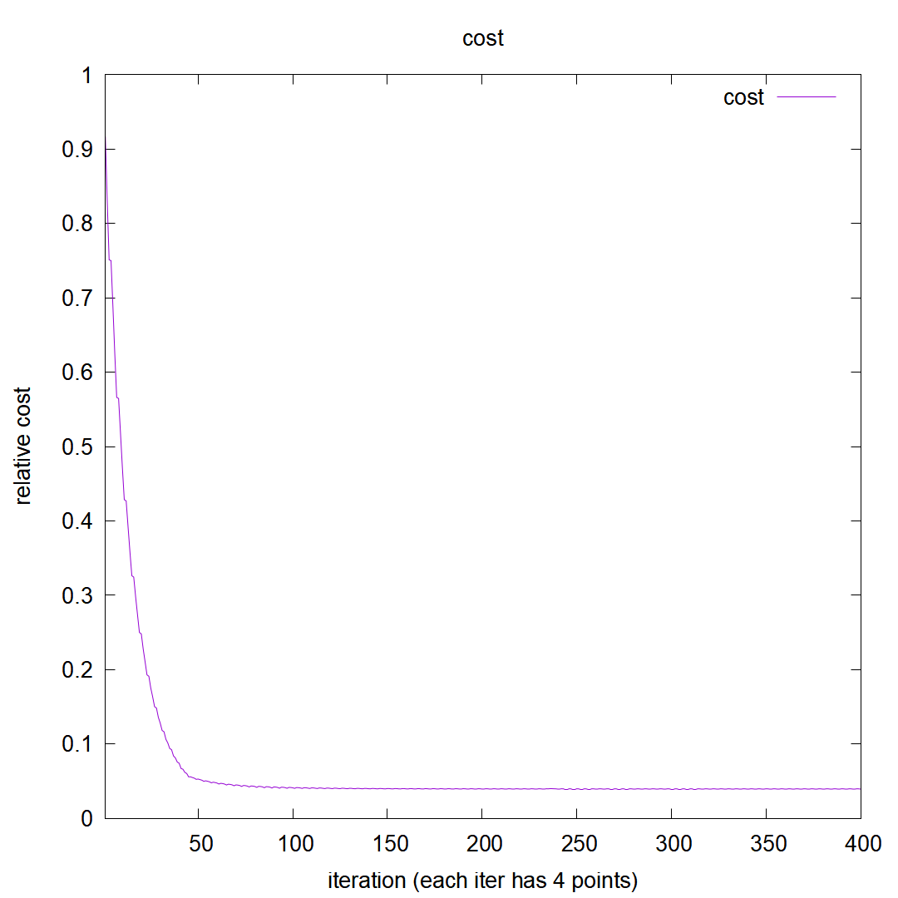

# HW4 - Basic demonstration for Supervised Learning Algorithm.

This homework implements a primitive approach to approximate the point having the smallest distance to all lines presented.

The approach here has flaws but can still demonstrate the concept of iteration in machine learning.

This work won't be possible without the help of <https://www.geogebra.org/graphing?lang=en>.

## Result - Video

1. Two line approximation demo video: <https://youtu.be/ysrils6EjMQ>
2. Three line approximation demo video: <https://youtu.be/Ehv5jl6ck3U>
3. Four line approximation demo video: <https://youtu.be/q6xPvh4n1L0>

## Result - Image

| Line Num | Iterations                    | Cost                          |
| -------- | ----------------------------- | ----------------------------- |
| 2        |  |  |
| 3        |  |  |
| 4        |  |  |
